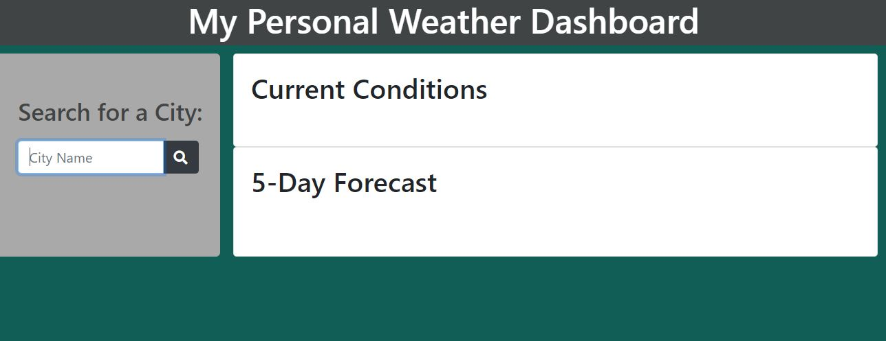
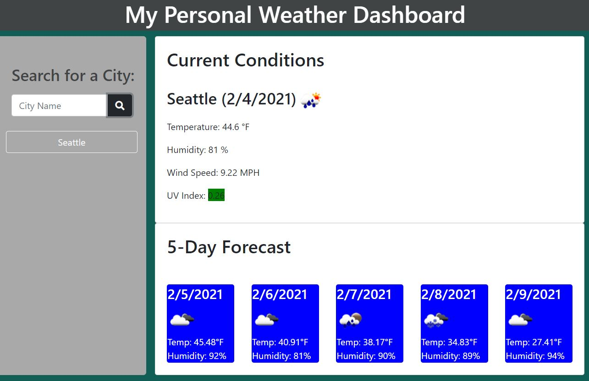
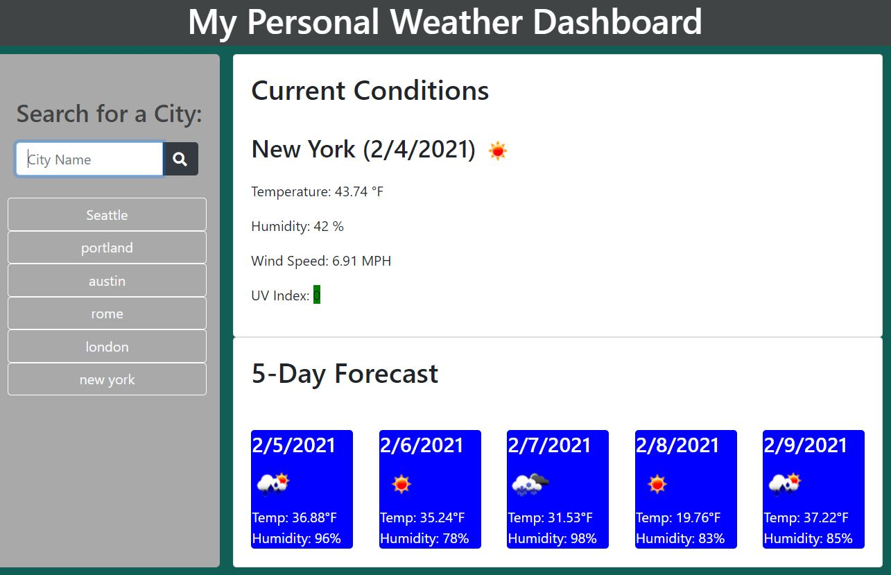

# WeatherDashboard
[View deployed application](https://rsowald.github.io/WeatherDashboard)

## About This Project
This weather dashboard is for a user who likes to travel or anyone curious about the weather in various places around the world. When the user wants to check the weather for their destination or any city they are curious about, they can type in the city name. No state, province, or even country is required.

When the search is submitted, the application makes three calls to different OpenWeatherMap APIs to get (1)the current weather conditions, (2)the current UV Index, and (3)the five day forecast. The application renders all of this data in a neat dashboard including a color-coded UV Index to show at a glance how much sun protection might be needed and sleek weather icons for current and forecasted conditions. The application then creates a button for each new search and saves the search to local storage so the city can be easily searched for again. The search history will persist even if the browser is closed or refreshed.

## Technologies Used
- OpenWeatherMap APIs
- jQuery
- Bootstrap
- Local Storage

## Usage

Start with a blank dashboard and no search history.

After the first search, there is one new button in the search history sidebar and the current conditions as well as a 5 day forecast are displayed in the main content.

As more searches are performed, more buttons are added to the search history sidebar and the main content shows the current search results.

## Future Features
- I would like to use a different API for this dashboard because, while OpenWeather does provide a lot of information, it is not always the most accurate. For example, because it does not require even a country, you might mean to look up weather in Alexandria, VA, USA but instead get results for Alexandria, Egypt.
- Possibly include a reset button for the search history list if the user feels like it is getting too long or they no longer have any interest in that city's weather.

## Contact
Renae Sowald - renaesowald@gmail.com

## License
[MIT](LICENSE)
